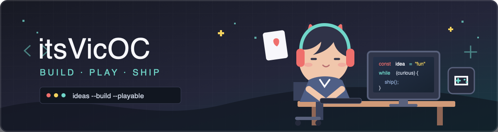
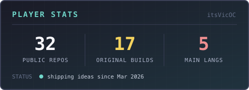
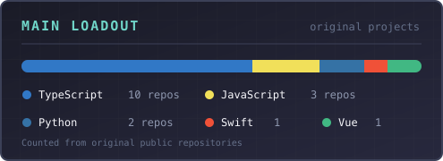

<div align="center">
  
</div>

<div align="center">

### 把脑洞做成能玩的东西，把重复动作变成顺手的工具。

`Game Mechanics` · `Useful Tools` · `Web Experiences` · `Native Apps`

[](https://github.com/itsVicOC)
[](https://github.com/itsVicOC?tab=followers)

</div>

---

## `> whoami`

你好，我是 **Vic**。

我喜欢把一个模糊的想法一路打磨到真正能运行、能交互、能交付：从终端里的掼蛋 AI，到浏览器中的塔防、数独与每日谜题；从 GUI / CLI 双模式下载器，到原生 macOS 应用。

对我来说，代码不只是实现功能，也是创造体验的媒介。

```text
正在探索：更有趣的交互 × 更扎实的工程 × 更完整的产品体验
开发状态：灵感加载中 █████████░ 90%
隐藏属性：对小游戏、效率工具和像素世界没有抵抗力
```

## `> highlights`

| | 我在做什么 | 亮点 |
|:--:|---|---|
| 🎮 | **把规则变成体验** | TUI、Canvas、PWA、排行榜，从玩法原型做到完整游戏 |
| 🛠️ | **把麻烦变成工具** | 重视速度、稳定性和真实使用场景，兼顾 GUI 与 CLI |
| 🧭 | **跨越不同终端** | Web、终端、macOS、微信小程序，不被单一平台限制 |
| ✨ | **让作品有一点性格** | 功能要可靠，交互也要有趣；实用和好玩可以同时存在 |

## `> featured_quests`

<table>
  <tr>
    <td width="50%" valign="top">
      <h3><a href="https://github.com/itsVicOC/guandan">🃏 guandan</a></h3>
      <p>本地终端掼蛋游戏，内置 5 档 AI。把复杂牌型、出牌规则和不同风格的对手装进 TUI。</p>
      <code>Python</code> <code>TUI</code> <code>Game AI</code>
    </td>
    <td width="50%" valign="top">
      <h3><a href="https://github.com/itsVicOC/bilibili-downloader">📺 bilibili-downloader</a></h3>
      <p>兼顾普通用户与命令行玩家的桌面下载工具，同一套能力同时提供 GUI 和 CLI。</p>
      <code>Python</code> <code>Desktop</code> <code>GUI + CLI</code>
    </td>
  </tr>
  <tr>
    <td width="50%" valign="top">
      <h3><a href="https://github.com/itsVicOC/pathforge-td">🏰 PathForge TD</a></h3>
      <p>基于网页 Canvas 的迷宫式塔防。路径规划、布塔策略和即时反馈组成一张可玩的棋盘。</p>
      <code>TypeScript</code> <code>Canvas</code> <code>Tower Defense</code>
    </td>
    <td width="50%" valign="top">
      <h3><a href="https://github.com/itsVicOC/gridGame">🧩 纸径</a></h3>
      <p>带全球排行榜的每日路径拼图 React PWA，让短小的日常挑战也拥有持续参与感。</p>
      <code>TypeScript</code> <code>React</code> <code>PWA</code>
    </td>
  </tr>
  <tr>
    <td width="50%" valign="top">
      <h3><a href="https://github.com/itsVicOC/PokemonDeck">🗂️ PokemonDeck</a></h3>
      <p>由 PokeAPI 驱动的可持续 Web 图鉴，把数据获取、信息组织和浏览体验放在一起。</p>
      <code>TypeScript</code> <code>Web</code> <code>PokeAPI</code>
    </td>
    <td width="50%" valign="top">
      <h3><a href="https://github.com/itsVicOC/PaperTodo-macOS">🍎 PaperTodo macOS</a></h3>
      <p>PaperTodo 的原生 macOS / AppKit 版本，从网页世界走进桌面端的产品实验。</p>
      <code>Swift</code> <code>AppKit</code> <code>macOS</code>
    </td>
  </tr>
</table>

## `> inventory`

<div align="center">
  
</div>

## `> player_stats`

<div align="center">
  
  
</div>

<div align="center">
  
</div>

---

<div align="center">

### `SAVE POINT REACHED`

**好玩的想法值得被实现，好用的工具值得被分享。**

<sub>Thanks for visiting. Have a good adventure.</sub>

</div>
